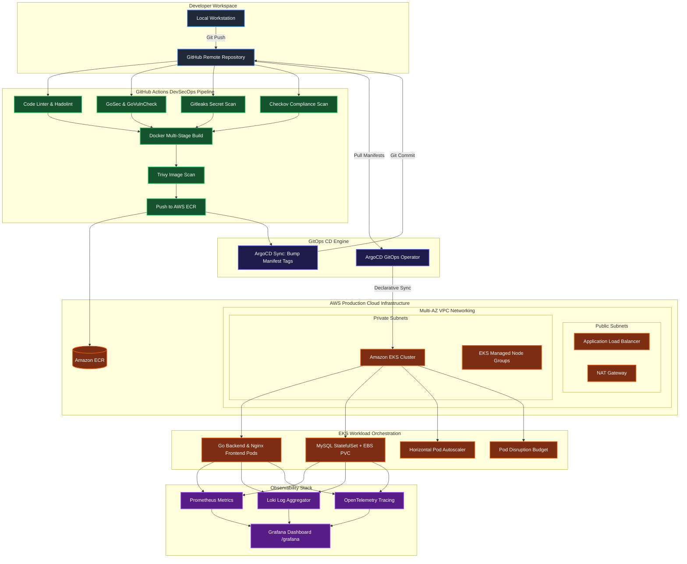

# SkillPulse — Production-Grade DevSecOps & GitOps Enterprise Showcase

<p align="center">
  
  
  
  
  
  
</p>
<p align="center">
  
  
  
  
  
</p>

---

## 🌟 Introduction & Project Scope

**SkillPulse** is a real-world, cloud-native 3-tier application designed to demonstrate the pinnacle of modern DevSecOps, Infrastructure as Code (IaC), GitOps continuous delivery, and full-stack Kubernetes observability. 

While the application itself allows students and developers to track learning skills and study logs, the primary core of this project is the **enterprise-grade platform engineering architecture wrapping it**. In a production setup, every single commit undergoes rigorous SAST compliance checks, dependency scans, container auditing, automatic GitOps manifest tagging, dynamic deployment to an encrypted AWS EKS cluster, DAST vulnerability scanning, and real-time email alerts and SMTP reporting—all fully automated in under three minutes.

---

## 🏗️ Platform Architecture



### 🛰️ System Components & Traffic Flow

1. **VPC Networking Sub-system**: 
   - Multi-AZ architecture configured across Public and Private subnets using Amazon Route 53, NAT Gateways, and ALB.
   - Protected by isolated network ACLs and strict security group ingress/egress rules limiting administrative surface.
2. **Kubernetes EKS Control-Plane**:
   - Provisioned via Terraform with Managed Node Groups, stateful and stateless isolation, and strict CPU/Memory resource constraints.
   - Hardened with EKS Access Entries and integrated KMS encryption key policies securing all secrets at rest.
3. **Application Stack & Delivery**:
   - **Frontend**: Nginx-based reverse proxy serving optimized vanilla JS static assets and securely proxying `/api/` endpoints to downstream servers.
   - **Backend**: High-throughput REST API server written in Go 1.23+ and Gin web framework.
   - **Database**: Hardened MySQL 8.4 StatefulSet utilizing persistent volume claims (PVC) with persistent EBS backing.
4. **GitOps Engine**:
   - ArgoCD controller operating inside EKS, listening to repository changes, auto-synchronizing, and dynamically exposing endpoints through customized subpaths.
5. **Observability Suite**:
   - Full telemetry flow including Prometheus metrics scraping, Loki centralized log management, Grafana visualization, and OpenTelemetry distributed tracing.
6. **Data Lifecycle Protection**:
   - Cron-triggered daily scheduled backups dumping cluster resource states and MySQL schemas to encrypted S3 buckets with complete automated email alerts.

---
## 🛡️ The 9-Stage Production DevSecOps Pipeline

The GitHub Actions pipeline (`.github/workflows/devsecops-pipeline.yml`) acts as our automated security gatekeeper:

| Stage | Tooling | Purpose | Behavior on Failure |
| :--- | :--- | :--- | :--- |
| **1. Linting & Secrets** | `Hadolint` & `Gitleaks` | Dockerfile syntax checks and blocking hardcoded credentials | Block pipeline |
| **2. SAST Audit** | `GoSec` & `GoVulnCheck` | Analyzing code patterns for vulnerabilities and out-of-date packages | Soft-fail / Audit |
| **3. IaC Compliance** | `Checkov` | Scans Terraform and Kubernetes manifests for security flaws | Soft-fail / Audit |
| **4. Multi-Stage Build** | `Docker` | Assembles highly optimized, minimal scratch-based runtime artifacts | Block pipeline |
| **5. Container Scan** | `Trivy` | Direct image analysis for high/critical security vulnerabilities | Block if Critical |
| **6. Integration Testing** | `Go Test` | Executes package unit and integration tests inside runner | Block pipeline |
| **7. ECR Artifact Promotion** | `AWS ECR` | Secure login, dynamic commit SHA tagging, and pushing verified images | Block pipeline |
| **8. GitOps Automation** | `ArgoCD / Git` | Automated manifest update with commit SHA, promoting to dev/prod environments | Block pipeline |
| **9. Telemetry & DAST** | `OWASP ZAP` & `Prometheus` | Web path scanning (DAST) on live endpoints while validating metrics/logs flow | Soft-fail / Email alert |

---

## 🏗️ Infrastructure as Code (Terraform Setup)

Our infrastructure is built using modular Terraform architectures separated into `dev` and `prod` environments:
- **State Storage**: Secure S3 remote state tracking with DynamoDB lock tables preventing simultaneous modifications.
- **Security Hardening**: Integrated AWS Key Management Service (KMS) encryption keys for cluster secrets protection.
- **Resilience**: Managed Node Groups, EKS Access policies, and clean network subnets across multiple Availability Zones.

### Automated Cloud Teardown Guidelines
To safely and cleanly destroy the AWS environment without leaving orphaned resources or failing midway due to external dependencies:
1. **ArgoCD Clean-up**: Terminate existing ArgoCD application mappings and delete the `monitoring` / `argocd` namespaces first. This prevents hanging resources and uninstalled Custom Resource Definitions (CRDs).
2. **Dynamic ELB Ingress Security Groups**: Dynamic LoadBalancers created by Kubernetes provision dynamic AWS Security Groups (e.g. `k8s-elb-...`). These are NOT managed by Terraform. Before completing `terraform destroy`, verify and delete these groups via the AWS CLI to allow the VPC to cleanly delete.
3. **State Push Recovery**: In case of a temporary DNS/network disruption during teardown, release any stuck state locks using:
   ```bash
   terraform force-unlock <lock-id>
   ```
   and push the locally saved `errored.tfstate` cleanly to restore remote backend state:
   ```bash
   terraform state push errored.tfstate
   ```

---

## 📊 Observability & Telemetry

Our observability stack provides full system transparency, ensuring you are never flying blind:

- **Metrics (Prometheus)**: Custom endpoint scraping tracking memory, CPU utilization, Go garbage collection, database connection pools, and API requests.
- **Log Aggregation (Loki)**: Centralized cluster-wide logs collection grouped by pod namespace and container labels.
- **Visualization (Grafana)**: Dashboard mapped under a secure subpath `/grafana`, presenting real-time system health and bottleneck tracking.
- **Tracing (OpenTelemetry)**: Microservice context propagation tracing API response times directly from client click down to database commit.

---

## 💾 Production Data Protection & Backup Lifecycle

Our backup pipeline (`.github/workflows/scheduled-backup.yml` and `scripts/backup.sh`) secures database states and cluster configuration schemas daily:
- **Automatic Execution**: Runs as a daily cron at midnight and supports manual `workflow_dispatch` execution.
- **State Capture**: Extracts full cluster resources schema definitions (`resources.yaml`) and sensitive configs/secrets (`config_secrets.yaml`).
- **Database Dump**: Executes a synchronous live dump of all database tables from the running MySQL StatefulSet container.
- **Archiving & Delivery**: Bundles, tar-gz compresses, and uploads the backup package directly to secure AWS S3 buckets (`s3://skillpulse-backups-815210276744`).
- **Notification**: Reports backup completion results immediately via structured email dispatches to administrators.

---

## 🚀 Running the Project

### 1. Local Development via Docker Compose
Perfect for local API integration and frontend styling loops. Nginx reverse proxies traffic exactly like production.
```bash
cp .env.example .env
docker compose up -d --build

### 2. Local Kubernetes Simulation (Kind)
Test production manifests (HPA, PDB, ConfigMaps, Secrets, Services) on a multi-node Kubernetes cluster.
```bash
brew install kind kubectl
make up
# Open http://localhost:8888
# Rollout updates
make restart
# Teardown cluster
make down
```

### 3. Production Deployment to EKS (AWS)
Provision and sync to production.
```bash
cd terraform/environments/dev
terraform init
terraform apply -auto-approve
# Retrieve cluster credentials
aws eks update-kubeconfig --region eu-west-1 --name skillpulse-dev
```

---

## 📂 Project Structure

```
.
├── .github/workflows/
│   ├── devsecops-pipeline.yml   # Multi-stage production pipeline
│   ├── argocd-sync.yml          # GitOps synchronization trigger
│   └── scheduled-backup.yml     # Automated daily backup lifecycle
├── backend/                     # Go REST backend service
├── frontend/                    # Nginx + Vanilla JS frontend service
├── k8s/                         # Kubernetes deployment manifests
│   ├── mysql/                   # MySQL database stateful configurations
│   └── skillpulse/              # HPA, PDB, Ingress, Deployments, and Services
├── scripts/
│   └── backup.sh                # Backup compilation and S3 upload script
├── terraform/                   # AWS EKS Provisioning templates
│   ├── modules/                 # Reusable modules (VPC, EKS, Monitoring)
│   └── environments/            # Target environments (Dev/Prod directories)
└── README.md                    # System documentation
```
---

## 🏆 Credits & Mentorship

Built with ❤️ for the [TrainWithShubham](https://www.youtube.com/@TrainWithShubham) community. Elevating developers to true platform engineers.
